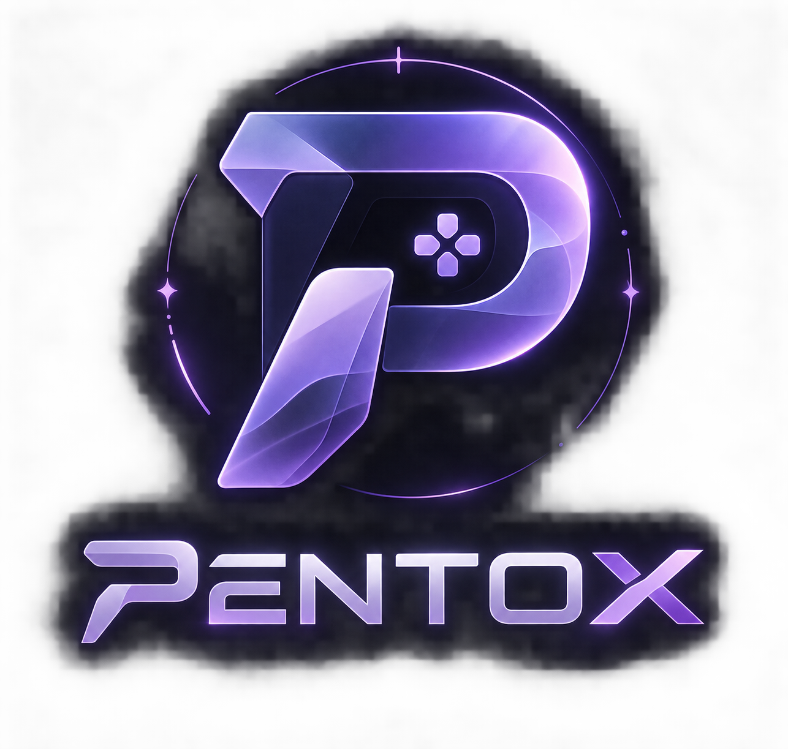

<div align="center">



# ▲ Pentox

**A from-scratch Linux gaming overlay.**

> **Pentox 1.0 is stable and production-ready.**
> The capture shims, HUD, watcher, GUI and CLI are covered by a test suite
> and continuous integration. Expect incremental improvements, not breakage.

No MangoHud, no GOverlay, no embedded HUD engines — the overlay, metrics
engine, frame-capture shims, watcher and integrations are all written here.

**Dark glass · Lavender accents · JetBrains Mono · end4-pC inspired**

</div>

---

## Project Status

Pentox **1.0** is a stable release. The core architecture — overlay,
metrics engine, frame-capture layers, game watcher, GUI and desktop
integrations — is complete and covered by automated tests
(`pytest`) and CI.

What you can rely on:

- ✅ Stable configuration and CLI interfaces
- ✅ Vulkan + OpenGL capture on AMD, NVIDIA and Intel
- ✅ Wayland (layer-shell), X11 fallback, Hyprland detection
- ✅ GUI control panel with launcher integration
- ✅ Graceful degradation: every metric probe is optional at runtime

Ongoing work continues on wider game compatibility, extra metrics and
packaging. Bug reports and contributions are welcome.

---

## Why

Existing HUDs are often tightly coupled to their rendering engines.

MangoHud provides a powerful gaming overlay, while GOverlay provides a GUI
for configuring it. Pentox takes a different approach: the overlay,
metrics engine, frame-capture layers and integrations are built directly
into the project.

Pentox aims to be a small, hackable Python + C project that:

- **Captures frames itself** — a hand-written Vulkan layer using
  `vkQueuePresentKHR` and a hand-written `LD_PRELOAD` shim using
  `eglSwapBuffers` / `glXSwapBuffers`
- **Renders the HUD itself** — GTK3 + gtk-layer-shell + Cairo
- **Works across environments** — Wayland with X11 fallback
- **Supports multiple GPU vendors** — AMD, NVIDIA and Intel
- **Requires no driver modifications**
- **Requires no compositor configuration edits**
- **Runs in user space**
- **Can be removed without leaving system modifications behind**

---

## Features

### 🎮 Gaming Overlay

- FPS
- Frame timing
- GPU statistics
- CPU statistics
- RAM / VRAM usage
- Temperature monitoring
- GPU clocks
- CPU clocks
- GPU power information
- Game detection
- Game session state

### 🖥️ Desktop Integration

- Wayland layer-shell support
- X11 fallback
- Hyprland integration
- Game watcher
- Taskbar/status chip
- Desktop notifications
- Global overlay toggle
- GUI control panel (`pentox gui`)
- Application launcher entry (search "Pentox")

### 🎨 UI

- Dark glass aesthetic
- Lavender accent palette
- JetBrains Mono
- end4-pC-inspired styling
- Cairo-rendered interface
- Configurable geometry and appearance

---

## Install

> ⚠️ Installation and compatibility are currently experimental.

```sh
git clone https://github.com/vin1397/pentox.git
cd pentox
./install.sh
```

The installer installs Pentox into the user's local environment, registers
the user-level watcher and adds an application entry, so **Pentox shows up in
your application launcher / search** — opening it starts the GUI control
panel.

### Requirements

- Python ≥ 3.9
- Python Cairo
- PyGObject
- GTK3
- gtk-layer-shell *(optional; X11 fallback available)*
- GCC
- Vulkan headers
- Make
- `notify-send`

Fish users:

```text
./install.sh
```

works as-is because the installer uses POSIX `sh`.

---

## Usage

### System self-test

```sh
pentox doctor
```

Runs diagnostics for:

- GPU metrics
- CPU metrics
- Layer-shell support
- Frame capture
- Runtime environment

### Launch an application with Pentox

```sh
pentox run -- vkcube
```

Or:

```sh
pentox run -- <application>
```

### Steam

```text
pentox run -- %command%
```

### Start the watcher

```sh
pentox watch
```

The watcher is normally started automatically by the installer.

### Open the control panel

```sh
pentox gui
```

Or just search for **Pentox** in your application launcher. The panel shows
session status with live FPS, starts/stops the watcher, toggles the overlay,
can launch a test capture and edits the common options.

### Toggle the overlay

```sh
pentox toggle
```

### Print status

```sh
pentox chip --print
```

This can be used by status bars and other scripts.

---

## Ambient Vulkan Capture

Pentox currently registers a Vulkan **implicit layer**.

This allows Vulkan applications to be frame-captured automatically without
requiring a wrapper command.

For example, Vulkan games launched normally can be detected by the watcher.

To disable Pentox Vulkan capture for an application:

```sh
PENTOX_VK_DISABLE=1
```

---

## OpenGL Capture

OpenGL applications can be captured through the `LD_PRELOAD` shim.

Launch an OpenGL application with:

```sh
pentox run -- <application>
```

Pentox currently hooks:

```text
eglSwapBuffers
glXSwapBuffers
```

---

## Steam

Vulkan titles can currently be captured through the Vulkan implicit layer.

For per-game control, use:

```text
pentox run -- %command%
```

> ⚠️ Steam and game compatibility are still being tested.

Different games, engines, graphics APIs, Proton versions and drivers may
behave differently while Pentox is under development.

---

## How It Works

```text
                    ┌─────────────────┐
                    │      Game       │
                    └────────┬────────┘
                             │
                   ┌─────────┴─────────┐
                   │                   │
              Vulkan Layer        OpenGL Shim
                   │                   │
                   └─────────┬─────────┘
                             │
                             ▼
                  /tmp/pentox-run-<pid>.ring
                             │
                             ▼
                       fpsreader
                             │
                             ▼
                    ┌────────────────┐
                    │     Overlay    │
                    │ GTK3 + Cairo   │
                    └───────┬────────┘
                            │
                            ▼
                     Layer-shell HUD
```

The watcher operates alongside the capture system:

```text
watch.py
   │
   ├── Game detection
   ├── Process monitoring
   ├── Hyprland IPC
   ├── Overlay spawning
   ├── Notifications
   └── Taskbar chip
```

---

## Architecture

```text
pentox/
├── pentox/
│   ├── cli.py
│   ├── gui.py
│   ├── overlay.py
│   ├── chip.py
│   ├── watch.py
│   ├── metrics.py
│   ├── fpsreader.py
│   ├── config.py
│   └── theme.py
│
├── src/
│   ├── ring.h
│   ├── pentox_gl.c
│   ├── pentox_vk.c
│   └── Pentox_layer.json
│
├── data/
│   ├── io.github.pentox.desktop
│   └── icons/
│
├── bin/
│   └── pentox
│
├── install.sh
└── pentox-watch.service
```

### Components

| Component | Purpose |
|---|---|
| `cli.py` | Command-line interface |
| `gui.py` | GTK3 control panel |
| `overlay.py` | GTK3 + Cairo HUD |
| `chip.py` | Taskbar/status chip |
| `watch.py` | Game/session detection |
| `metrics.py` | GPU/CPU system metrics |
| `fpsreader.py` | Frame-ring reader |
| `config.py` | Configuration handling |
| `theme.py` | UI theme and geometry |
| `pentox_vk.c` | Vulkan capture layer |
| `pentox_gl.c` | OpenGL capture shim |
| `ring.h` | Shared frame-ring structure |

---

## Configuration

Pentox uses:

```text
~/.config/pentox/pentox.conf
```

An example configuration is provided as:

```text
pentox.conf.example
```

Configuration uses a simple `key=value` format.

All configuration keys are optional.

Unknown keys are ignored.

> ⚠️ Configuration options may change while the project is under development.

---

## Development & Testing

Run the test suite:

```sh
python -m venv .venv
.venv/bin/pip install .[dev]
.venv/bin/pytest tests/ -q
```

Build the capture shims:

```sh
make
```

Continuous integration runs both on every push and pull request
(see `.github/workflows/ci.yml`). The suite covers the config parser,
frame-ring reader (against synthetic rings written exactly like the C
shims), metrics helpers and watcher heuristics.

---

## Compatibility

| Component | Current Target |
|---|---|
| Wayland | ✅ |
| X11 | ✅ |
| Hyprland | ✅ |
| wlroots | ✅ |
| GTK3 | ✅ |
| Vulkan | ✅ |
| OpenGL / OpenGL ES | ✅ |
| AMD | ✅ |
| NVIDIA | ✅ |
| Intel | ✅ |

### GPU

Pentox currently targets:

- AMD `amdgpu`
- NVIDIA
- Intel `i915` / `xe`

Metrics are collected through standard Linux interfaces such as:

```text
/sys
/proc
```

NVIDIA NVML support is optional.

### CPU

Pentox supports Linux CPUs through available kernel interfaces and sensors.

Potential sources include:

```text
k10temp
coretemp
zenpower
acpitz
RAPL
```

---

## Development Roadmap

The 1.0 foundation is stable; development continues on these areas.

### Capture

- [ ] Improve Proton compatibility
- [ ] Improve multi-process handling
- [ ] Finer frame-timing statistics

### Metrics

- [ ] More AMD / NVIDIA / Intel telemetry
- [ ] Additional CPU sensors
- [ ] Power monitoring improvements

### UI

- [ ] More layout options
- [ ] Configurable widgets
- [ ] Theme editor
- [ ] Better scaling for different displays

### Integration

- [ ] Improved Steam integration
- [ ] More compositor support
- [ ] More status-bar integrations
- [ ] Distros / Flatpak packaging

---

## Project Philosophy

Pentox is designed around a few simple principles:

### No External HUD Engine

The HUD is rendered by Pentox itself.

### No Driver Modifications

Pentox operates entirely in user space.

### No Compositor Configuration

The overlay should work without modifying compositor configuration.

### Hackable

The project is intentionally split between Python and C so individual
components can be inspected, modified and replaced easily.

### Portable

Where possible, Pentox relies on standard Linux interfaces rather than
vendor-specific APIs.

---

## Contributing

Pentox is still experimental and actively evolving.

Contributions are welcome.

You can help with:

- 🐛 Bug reports
- 🎮 Game compatibility testing
- 🖥️ Compositor testing
- 📊 Metrics support
- 🎨 UI improvements
- ⚙️ Performance optimization
- 🔧 Code contributions
- 📖 Documentation

Before submitting a large change, opening an issue to discuss the approach
is recommended.

---

## Known Limitations

Pentox 1.0 is stable, with a few honest caveats:

- Some games may not be detected correctly; the fallback detector is
  heuristic by design.
- OpenGL capture may vary between applications and drivers.
- GPU metrics depend on available kernel/vendor interfaces; unsupported
  probes are hidden rather than shown as zeros.
- Proton/Windows titles are tested on a best-effort basis — report what
  you find.

---

## Uninstall

Pentox is designed to be removable without modifying system drivers.

Use the uninstall functionality provided by the project:

```sh
./install.sh --uninstall
```

> Check the current installer options before running this command, as the
> uninstall interface may change during development.

---

## License

MIT License

See [`LICENSE`](LICENSE) for the full license text.

---

<div align="center">

**▲ Pentox**

*Built from scratch for Linux gaming.*

🚧 **Under active development**

</div>